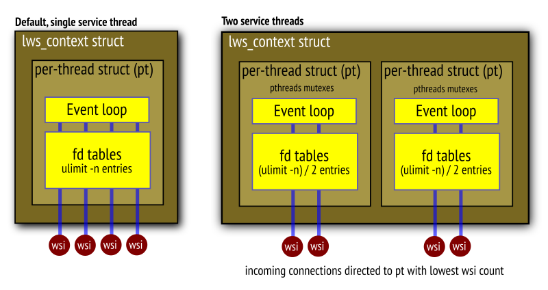
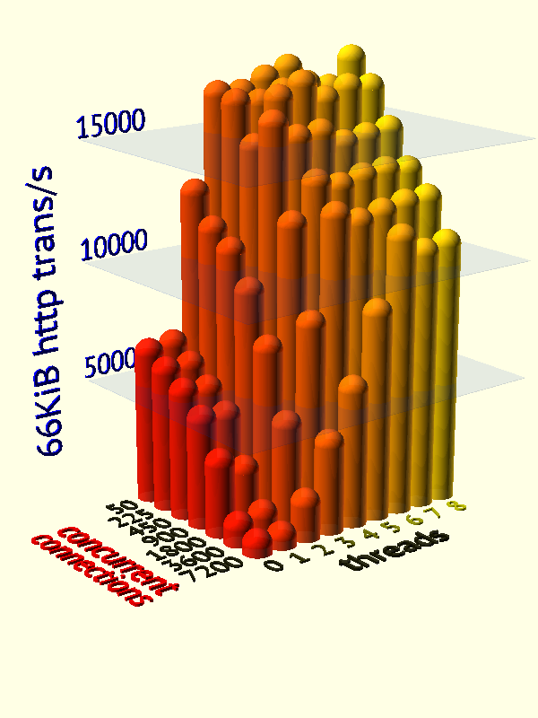

# lws minimal http server with multithreaded service

Lws supports multithreaded service... build lws with `-DLWS_MAP_SMP=<max number of threads>`, the
default is 1.  If nonzero, some extra pthreads locking is built into lws and it supports multiple
independent service threads.



When an incoming connection is accepted, it is bound to the pt with the lowest current wsi
count, to keep the load on the threads balanced.  Only the pt the wsi is bound to can service
the thread, so although there can be as many wsi being serviced simultaneously as there are
service threads, a wsi can only be service by the pt it is bound to.

The effectiveness of the scalability depends on the load.  Here is an example of roughly what can be expected



## build

```
 $ cmake . && make
```

## usage

```
 $ ./lws-minimal-http-server-smp
[2018/03/07 17:44:20:2409] USER: LWS minimal http server SMP | visit http://localhost:7681
[2018/03/07 17:44:20:2410] NOTICE: Creating Vhost 'default' port 7681, 1 protocols, IPv6 on
[2018/03/07 17:44:20:2411] NOTICE:   Service threads: 10
```

Visit http://localhost:7681 and use ab or other testing tools

